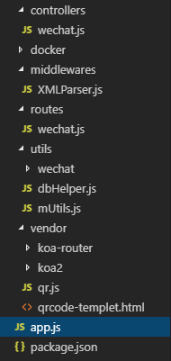
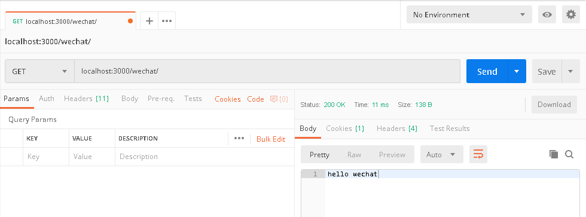
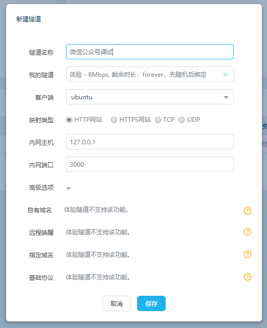
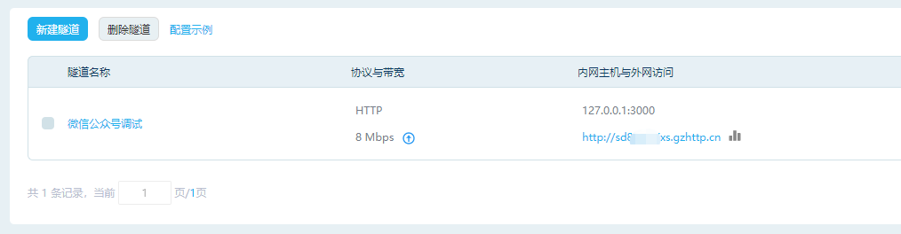
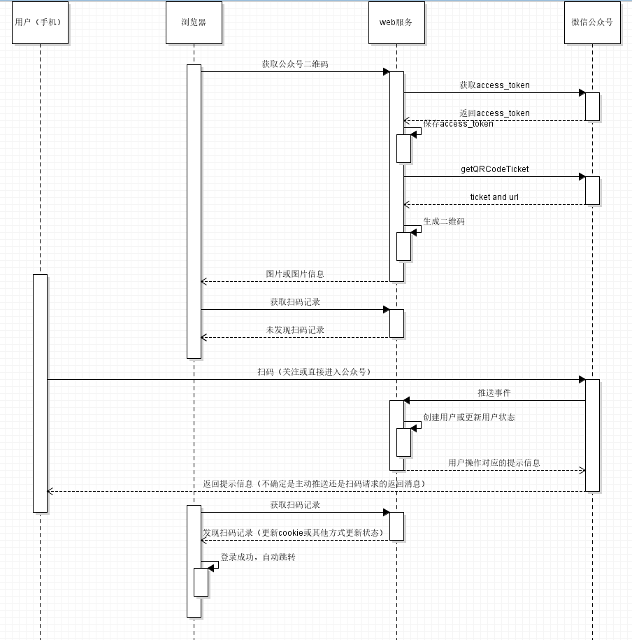
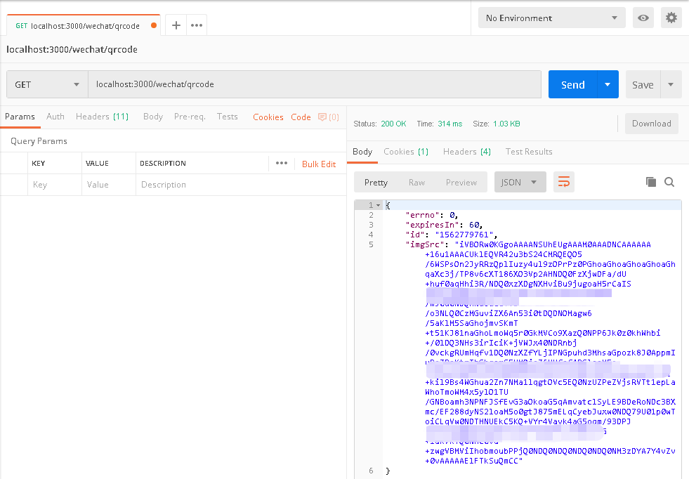
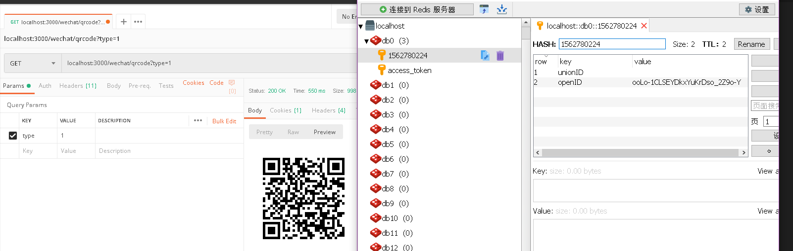
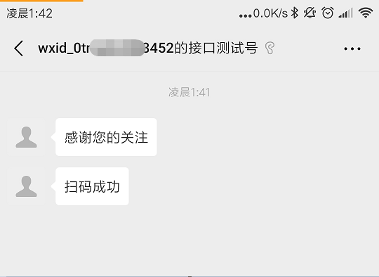
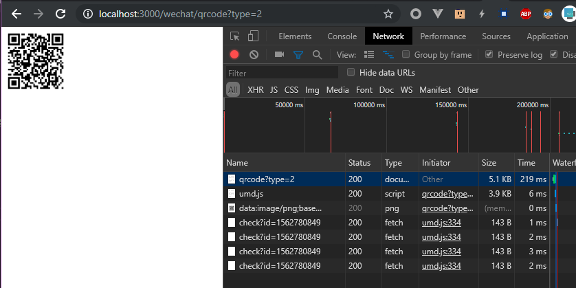

<style>p{ text-indent: 2rem; }</style>

## 快速实现微信扫码关注公众号/用户注册并登陆

上周二开晨会分配任务的时候，分配到了一个微信扫码关注公众号的需求。刚开始以为只要截个公众号二维码的图，然后按照UI小姐姐出的设计稿把二维码放到指定位置，再加上一波加边框加阴影的操作提交就完事了。所以当部门大佬问多久能做完的时候，我毫不犹豫地说：小Case啦，两天妥妥的！  

回到座位上本想着时间还早，先刷会微博。刷着刷着看到广州东站的宜家要搬迁的消息，活动大减价全场5折起！！忍不住点进去宜家的网上商城，看了两圈好想剁手买买买。这时，部门大佬站了起来，好像正往我这边看。算了算了，先关注宜家公众号干活去吧，拿出手机准备扫码的时候整个人都懵了...  

诶？诶诶？！早上的需求好像是要**实现扫码关注公众号并登陆**的，但浏览器怎么会知道我扫码了，而且扫的还是登陆用的二维码...这怎么跟想象的不一样，我还打包票说两天内做完，真的完了完了。  

当然，两天后这扫码的功能还是经过测试按时提交，并在线上稳定运行了一周。如何才能快速实现，并尽量少踩坑，我想，有些思路和和代码写下来，以后可能会用得着。

项目主要以**Nodejs**进行开发，优先选用Koa2 + got + Redis等一些比较轻量级的框架（模块）/数据库实现，配合Alpine Linux制作Docker Image，最后得到的一个开箱即用的Docker镜像也仅仅只有**33M**。  


**先整理一下需求：**  

* 登录入口实现扫描二维码**关注公众号并登录网站**。已关注的直接跳转登陆，未关注的等待用户关注再跳转；

* 新的**公众平台**扫码登录机制代替原有的微信**开放平台**的扫码登录；

* 扫码关注后需要根据情况返回不同的提示（欢迎）信息。

但目前已上线的网站同时提供微信扫码和手机/邮箱注册登录，新需求实际是想让更多的用户关注公众号。完全按照需求上做的话就会变成强制用户必须关注公众号，否则无法完成登录。考虑到市场上有不少同类型产品，这种强制的行为可能会导致用户反感，从而选择其他产品。

**经讨论需求改为：**

* 保留现有的微信扫码和手机/邮箱注册登录，完成注册/登录流程后，新增一个扫码关注公众号的页面；

* 用户扫码关注，关注后利用**[unionid机制](https://mp.weixin.qq.com/wiki?t=resource/res_main&id=mp1421140839)**绑定账户，让手机/邮箱注册的用户以后可以直接微信扫码登录；

* 点击关注后，网站**自动跳转**进入控制台，或点击暂不关注直接跳转；

* 扫码关注后需要根据情况返回不同的提示（欢迎）信息。

**实现思路和步骤：**

1. 实现一个与微信公众号平台交互的API，接收并处理公众号推送的事件（关注、扫码和文字消息等）；
2. 实现一个生成二维码的API供浏览器调用，API可通过参数声明需要返回的格式；
3. 请求公众平台 →【[生成带参数的二维码](https://mp.weixin.qq.com/wiki?t=resource/res_main&id=mp1443433542)】接口生成带有场景值的二维码，生成成功后记录到数据库并返回；
4. 浏览器获取二维码信息后轮询二维码的扫描状态，扫描成功后自动跳转；
5. 用户扫码后，公众平台会向1实现的API推送事件，如果是关注就获取用户信息，然后记录到数据库。


#### 第一步，搭建Koa的环境并接入微信公众平台

提供的源码里包含删减过的 Koa2和 koa-router的代码，也可以使用原版的代码。建议使用Nodejs10以上版本，特别是Nodejs12，换了新的HTTP解析器（[llhttp](https://github.com/nodejs/llhttp)）性能直接提高了一倍。

**安装依赖**

package.json

```javascript
"dependencies": {
    "debug": "^4.1.1",
    "got": "^9.6.0",
    "ioredis": "^4.10.0",
    "mime-types": "^2.1.24",
    "negotiator": "^0.6.2",
    "xml2js": "^0.4.19",
    "ylru": "^1.2.1"
  }
```

*如果是直接用官方的Koa，mime-types，negotiator，ylru都不用安装*


目录结构



app.js

```javascript
const http = require('http')
const Koa = require('./vendor/koa2/application')
const XMLParser = require('./middlewares/XMLParser')
const router = require('./routes/wechat')
const app = new Koa()

app.use(XMLParser) // 解析xml的中间件，用于预处理微信公众号推送的事件

app.use(router.routes())
app.use(router.allowedMethods())

http.createServer(app.callback()).listen(3000)
```

/middlewares/XMLParser.js

```javascript
const parseXML = require('xml2js').parseString
const debug = require('debug')('xml-parse')

const parse = (req, options = {}) => {
  return new Promise((resolve, reject) => {
    let xml = ''
    req.on('data', chunk => { xml += chunk.toString('utf-8') })
    .on('error', reject)
    .on('end', () => parseXML(xml, options, (err, res) => {
      if (err) reject(err)
      resolve(res)
    }))
  })
}

module.exports = async (ctx, next) => {
  // 这里先尝试直接匹配，匹配失败再到mime库里查询
  if (ctx.request.type === 'text/xml' || ctx.is('xml')) {
    try {
      ctx.request.body = await parse(ctx.req)
    } catch (e) {
      debug(e.message)
    }
  }
  await next()
}
```

/routes/wechat.js

```javascript
const Router = require('../vendor/koa-router')
const wechatController = require('../controllers/wechat')


const router = new Router({
  prefix: '/wechat'
})

// 测试号配置接口信息时需要校验，但传输的数据跟推送消息一样，所以放在同一个controller里处理
// conntroller的完整path是/wechat/event，这个后面配置测试号URL的时候会用到
router
  .get('/', ctx => ctx.body = 'hello wechat')
  .get('/event', wechatController)
  .post('/event', wechatController)

module.exports = router

```

先新建一个配置文件，与app.js同目录

config.js

*WXMP的信息暂时留空，到配置微信公众平台的时候再填写*

```javascript
const CACHE = {
  host: 'localhost',
  port: 6379
}

// WeChat Media Platform
const WXMP = {
  appID: '',
  appSecret: '',
  token: ''
}

module.exports = {
  CACHE,
  WXMP
}
```

/controllers/wechat.js

```javascript
const { WXMP } = require('../config');
const { SHA1 } = require('../utils/mUtils')

module.exports = async (ctx, next) => {
  const token = WXMP.token
  const { signature, nonce, timestamp, echostr } = ctx.query

  /**
   * https://mp.weixin.qq.com/wiki?t=resource/res_main&id=mp1421135319
   * 1）将token、timestamp、nonce三个参数进行字典序排序
   * 2）将三个参数字符串拼接成一个字符串进行sha1加密
   * 3）开发者获得加密后的字符串可与signature对比，标识该请求来源于微信
  */
  const str = [token, timestamp, nonce].sort().join('')

  const signVerified = SHA1(str) === signature

  if (!signVerified) {
    ctx.status = 404 // 可以不设为404，koa默认的状态值就是404
    return
  }

  if (ctx.method === 'GET') ctx.body = echostr
  else if (ctx.method === 'POST') {
    // 实现思路里的第一步
    // 推送的消息会以POST的方式进到这里，暂时用不着，先放着
  }
}
```

来到这里，先测试一下Web服务是否能正常跑起来。这里使用Postman直接发请求，也可以用浏览器访问http://localhost:3000/wechat/。




**接下来配置一下微信公众平台。**

线上的环境经不起折腾，还是用[公众号测试号](https://mp.weixin.qq.com/wiki?t=resource/res_main&id=mp1421137522)进行调试吧，如果你是刚开始接触微信公众号开发，推荐使用测试号。

扫码登陆后会看到这样一个界面：


​		appID和appsecret是系统生成的，只需要填写URL和Token。把appID和appsecret贴到之前创建的config.js中，token自己随便输入，保证两个token一致即可。配置URL之前，我们需要一个域名和一个[内网穿透](https://www.baidu.com/s?ie=utf-&wd=%E5%86%85%E7%BD%91%E7%A9%BF%E9%80%8F)的环境。旧版本的[微信web开发工具](https://mp.weixin.qq.com/wiki?t=resource/res_main&id=mp1455784140)提供一个类似的方式，让微信服务器可以向我们在内网的机器推送消息，新版没有这功能我们就自己百度一个吧。  

​		粗略比较了一下，发现[续断内网穿透](http://www.zhexi.tech/)很大方，只要9.9就有两条8M永久使用的隧道（只比KFC会员价的原味鸡贵4毛，尊贵的VIP吃鸡怎么还这么贵(╯‵□′)╯︵┻━┻）。注册交了9.9入会费，装上客户端后进行简单配置就可以了，体验挺棒的。设置过程中发现他家支持好多系统，像群晖、OpenWRT那些都有，还有树莓派，看来吃尘多年的B+可以拿出来发挥余热了。好像还有一些有趣的功能，可惜体验隧道不支持。不过只要9.9，还要啥自行车呢，果断开干吧！  



点击保存稍等一会会得到一个外网访问地址，类似http://sd8xxxxxxxxs.gzhttp.cn



接着把外网访问地址+之前定义的path（http://sd8xxxxxxxxs.gzhttp.cn/wechat/event）填写到测试号接口配置的URL中，然后点击提交。这时我们已经成功接入到微信公众平台了。


#### 第二步，实现一个生成二维码的API并完善与微信公众号平台交互的API

开始第二步之前，先来了解一下创建二维码及用户扫码后公众号给web服务推送消息的流程：




首先在utils/wechat/文件夹中新建一个helper.js，负责提供公众号配置（用于下面创建wechat对象）和get/set access_token的两个方法。

helper.js

```javascript
const { WXMP } = require('../../config')
const { redis } = require('../dbHelper')

const config = {
  MP: {
    appID: WXMP.appID,
    appSecret: WXMP.appSecret,
    token: WXMP.token,
    getAccessToken: async () => {
      let token = await redis.get('access_token')
      return token
    },
    saveAccessToken: async (data = {}) => {
      await redis.set('access_token', data.access_token ,'EX', data.expires_in)
    }
  }
}

module.exports = {
  ...config
}
```

在utils/wechat/文件夹中新建一个wxmp.js，定义一个Wechat类

```javascript
...
const api = {
  accessToken: 'token?grant_type=client_credential',
  user: {
    info: 'user/info?',
  },
  QRCodeTicket: 'qrcode/create?',
  QRCode: 'showqrcode?'
}

class Wechat {
  constructor (opts) {
    // 这里的opts传入的是上面定义的config
    ...
    this.fetchAccessToken(true)
  }
  // 获取access_token
  async fetchAccessToken (init = false) {
    let token = await this.getAccessToken()

    if (!token) {
      token = await this.updateAccessToken()
      await this.saveAccessToken(token)
      token = token.access_token
    }
    return token
  }

  async updateAccessToken () {
    const url = api.accessToken + '&appid=' + this.appID + '&secret=' + this.appSecret
    return await got(url)
  }

  // 提供一个统一操作的入口，第一个参数传入操作函数名就可以拿到对应的配置
  async handle (operation, ...args) {
    const token = await this.fetchAccessToken()
    if (!token) return {}

    const options = this[operation](token, ...args)
    let res = await wxGot(options)

    return res
  }

  // 获取用户信息
  getUserInfo (token, openID, lang) {
    const url = `${api.user.info}access_token=${token}&openid=${openID}&lang=${lang || 'zh_CN'}`

    return { url: url }
  }

  // 申请二维码Ticket
  getQRCodeTicket (token, sceneStr, timeout) {
    return {
      url: `${api.QRCodeTicket}access_token=${token}`,
      method: 'post',
      body: {
        "expire_seconds": timeout || 60,
        "action_name": "QR_STR_SCENE", // 临时二维码
        "action_info": {
          "scene": {
            "scene_str": sceneStr
          }
        }
      }
    }
  }
}

module.exports = Wechat

```


我们继续回到刚才的/routes/wechat.js，增加 “+” 标识的代码（新增获取二维码的路由）

```javascript
const Router = require('../vendor/koa-router')
const wechatController = require('../controllers/wechat')
+ const { createQRCodeMB } = require('../controllers/wechat')

const router = new Router({
  prefix: '/wechat'
})

// 测试号配置接口信息时需要校验，但传输的数据跟推送消息一样，所以放在同一个controller里处理
// conntroller的完整path是/wechat/event，这个后面配置测试号URL的时候会用到
router
  .get('/', ctx => ctx.body = 'hello wechat')
  .get('/event', wechatController)
  .post('/event', wechatController)
+ .get('/qrcode', createQRCodeMB)

module.exports = router
```

然后打开/controllers/wechat.js

推送事件类型可以参考[这里](https://mp.weixin.qq.com/wiki?t=resource/res_main&id=mp1421140454)

```javascript
const { WXMP } = require('../config');
const { SHA1, fmtNormalXML, streamToBuffer, createTimestamp } = require('../utils/mUtils')
const { redis } = require('../utils/dbHelper')
const Wechat = require('../utils/wechat/wxmp')
const MPConfig = require('../utils/wechat/helper').MP
const got = require('got')
const qr = require('../vendor/qr')
const fs = require('fs')
const pathResolve = require('path').resolve

const MP = new Wechat(MPConfig)

module.exports = async (ctx, next) => {
  ...

  if (ctx.method === 'GET') ctx.body = echostr
  else if (ctx.method === 'POST') {
    // 把数组形态的xmlObject转换可读性更高的结构
    const message = fmtNormalXML(ctx.request.body.xml)

    const msgType = message.MsgType
    const msgEvent = message.Event
    const userID = message.FromUserName
    let eventKey = message.EventKey
    let body = null

    if (msgType === 'event') {
      switch (msgEvent) {
        // 关注&取关
        case 'subscribe':
        case 'unsubscribe':
          body = await subscribe(message)
          break
        // 关注后扫码
        case 'SCAN':
          body = '扫码成功'
          break
      }
      
      if (!!eventKey) {
        // 有场景值（扫了我们生成的二维码）
        let user = await MP.handle('getUserInfo', userID)
        let userInfo = `${user.nickname}（${user.sex ? '男' : '女'}, ${user.province}${user.city}）`
        if (eventKey.slice(0, 8) === 'qrscene_') {
          // 扫码并关注
          // 关注就创建帐号的话可以在这里把用户信息写入数据库完成用户注册
          eventKey = eventKey.slice(8)
          console.log(userInfo + '扫码并关注了公众号')
        } else {
          // 已关注
          console.log(userInfo + '扫码进入了公众号')
        }

        // 更新扫码记录，供浏览器扫码状态轮询
        await redis.pipeline()
                    .hset(eventKey, 'unionID', user.unionid || '') // 仅unionid机制下有效
                    .hset(eventKey, 'openID', user.openid)
                    .expire(eventKey, 10)
                    .exec()
      }
    }
  }
}

async function subscribe (message) {
  let userID = message.FromUserName
  if (message.Event === 'subscribe') {
    return '感谢您的关注'
  } else {
    // 用户取消关注后我们不能再通过微信的接口拿到用户信息，
    // 如果要记录用户信息，需要从我们自己的用户记录里获取该信息。
    // 所以建议创建用户时除了unionid，最好把openid也保存起来。
    console.log(userID + '取关了')
  }
}

const templetData = fs.readFileSync(pathResolve(__dirname, '../vendor/qrcode-templet.html'))

// 创建二维码
async function createQRCodeMB (ctx, next) {
  let userID = ctx.query.userID
  let type = +ctx.query.type
  let errno = 0
  let responseDate = {}
  let id = createTimestamp()

  let res = await MP.handle('getQRCodeTicket', id)

  if (res === null) errno = 1
  else {
    responseDate = {
      expiresIn: res.expire_seconds,
      id
    }

    let imgBuffer = await streamToBuffer(qr.image(res.url))
    let imgSrc = imgBuffer.toString('base64')

    if (type === 1) {
      // 返回图片
      ctx.body = ``
    } else if (type === 2) {
      // 返回一个自带查询状态和跳转的网页
      let templetValue = `
        <script>var imgSrc='${imgSrc}',id='${responseDate.id}',
        timeout=${responseDate.expiresIn},width=100,height=100</script>`

      ctx.body = templetValue + templetData.toString('utf-8')
    } else {
      // 返回图片内容
      responseDate.imgSrc = imgSrc
    }
  }

  if (!ctx.body) {
    ctx.body = {
      errno,
      ...responseDate
    }
  }
}

module.exports.createQRCodeMB = createQRCodeMB
```

到这里应该是可以接收到公众号推送的扫码事件和生成二维码。

保存后我们先测试一下，首先不带参数访问http://localhost:3000/wechat/qrcode



接着尝试获取二维码图片（使用参数type=1）并使用微信扫描二维码：



首次扫描二维码会提示关注，点击关注后数据库就会更新，控制台也会打印出类似 “XXX扫码并关注了公众号“ 的日志。但这时候公众号里应该会提示 ”该公众号提供的服务出现故障，请稍后再试“ 的提示，因为程序并没有把提示信息正确得返回。下一步我们需要格式化返回的信息（即ctx.body的内容）。


新增一个生成模板的文件/utils/tmpl.js

格式化给[公众号返回的消息](https://mp.weixin.qq.com/wiki?t=resource/res_main&id=mp1421140453)，这里只简单使用util.format来格式化消息。

```javascript
const util = require('util')

const msgTemplet = `
<xml>
  <ToUserName><![CDATA[%s]]></ToUserName>
  <FromUserName><![CDATA[%s]]></FromUserName>
  <CreateTime>%d</CreateTime>
  <MsgType><![CDATA[%s]]></MsgType>
  $msgBody$
</xml>
`

const textMsg = `<Content><![CDATA[%s]]></Content>`
const imageMsg = `<Image><MediaId><![CDATA[%s]]></MediaId></Image>`

module.exports = (ctx, originMsg) => {
  let type = (ctx && ctx.type) || 'text'
  let msgTmpl = util.format(msgTemplet,
    originMsg.FromUserName,
    originMsg.ToUserName,
    Math.floor(new Date().getTime() / 1000),
    type
  )

  let body = ''

  switch (type) {
    case 'text':
      body = util.format(textMsg, ctx)
      break
    case 'image':
      break
    default:
      body = util.format(textMsg, '操作无效')
  }

  return msgTmpl.replace(/\$msgBody\$/, body)
}
```

接着我们在controllers/wechat.js增加一下 ”+“ 标记的代码

~~~javascript
const { WXMP } = require('../config');
const { SHA1, fmtNormalXML, streamToBuffer, createTimestamp } = require('../utils/mUtils')
+ const { tmpl } = require('../utils/wechat')
const { redis } = require('../utils/dbHelper')
const Wechat = require('../utils/wechat/wxmp')
...
module.exports = async (ctx, next) => {
  const token = WXMP.token
  const { signature, nonce, timestamp, echostr } = ctx.query

  const str = [token, timestamp, nonce].sort().join('')
 ...
        // 更新扫码记录，供浏览器扫码状态轮询
        await redis.pipeline()
                    .hset(eventKey, 'unionID', user.unionid || '') // 仅unionid机制下有效
                    .hset(eventKey, 'openID', user.openid)
                    .expire(eventKey, 10)
                    .exec()
      }
    }

+   ctx.type = 'application/xml'
+   ctx.body = tmpl(body || ctx.body, message)
  }
}

async function subscribe (message) {
  let userID = message.FromUserName
  if (message.Event === 'subscribe') {
    return '感谢您的关注'
  } else {
    console.log(userID + '取关了')
  }
}
~~~

保存后再获取一次二维码并扫描，微信上就能正确显示提示信息了：




#### 第三步，浏览器增加扫码状态轮询

这块跟业务代码关系比较密切，所以不做详细介绍。共通点就是通过二维码返回id获取unionid（openid）的记录，然后按需处理，最后以cookies或其他方式更新登录状态。

轮询的代码可以参考vendor/qrcode-templet.html

```javascript
async function waitToSubscribe(id, timeout) {
    let countdown = Math.ceil(timeout / 3);
    return new Promise((resolve, reject) => {
        const loop = async function() {
            let res = await ky.default.get("/wechat/check", {
                                searchParams: { id }
                            }).json();
            if (!res) return;
            if (res.errno === 0) resolve("subscribe");
            else if (res.errno === 2) reject("timeout");
            else if (countdown-- > 0) self.QRCodeTimer = setTimeout(loop, 3000);
        };
        loop();
    });
}
(async () => {
    try {
        await waitToSubscribe(id, timeout);
        window.location.href = "/wechat/";
    } catch (e) {
        history.go(0);
    }
})();
```

我们可以尝试获取集成好获取状态的二维码网页（使用参数type=2，实际使用时可以用iframe嵌套）：




#### 总结：

到这里，我们已经实现了：

1. 与微信公众号平台交互的API，能够接收并处理公众号推送的事件；
2. 生成二维码的API，并能分别以三种常用方式返回二维码；
3. 扫描二维码后，微信上能正常显示服务返回的提示信息，并成功记录在数据库中；
4. 当浏览器轮询二维码的扫描状态并获取到扫描结果后，自动跳转。

以上几乎包含了公众号开发的完整流程，其他的功能可以参照公众号开发文档上的说明按需增加。这里有一点需要注意的，文中提到的unionid机制需要以公司身份申请正式的公众号和微信开放平台，并在开放平台上完成公众号绑定。同一个用户在已绑定公众号、小程序、网站应用等程序里会使用同一个unionid来确定用户的唯一性。

像公众号网页授权、开放平台的网站应用授权（类似京东的扫码登录）和小程序的开发，等有空的时候再更新。码了这么多字，差点忘了要去宜家扫货，广告上说促销商品数量有限，万一卖完了岂不是错过了几个亿::>_<::，周末要找个时间过去看看才行。


#### 最后附上Dockerfile 和源码地址

预先拷贝文件到/build目录，便于生成更小的Docker Image

```
cp -rf vendor docker/build/vendor
cp -rf utils docker/build/utils
cp -rf routes docker/build/routes
cp -rf middlewares docker/build/middlewares
cp -rf controllers docker/build/controllers
cp app.js docker/build/app.js
cp config.js docker/build/config.js
```


```dockerfile
FROM alpine
COPY package.json /var/www/wechat-mp/
WORKDIR /var/www/wechat-mp
RUN sed -i 's/dl-cdn.alpinelinux.org/mirrors.aliyun.com/g' /etc/apk/repositories \
    && apk add nodejs npm \
    && npm install --production --registry=https://registry.npm.taobao.org \
    && npm cache clean -f \
    && rm package-lock.json \
    && apk del npm \
    && rm -rf ~/.npm \
    && rm -rf /var/cache/apk/* \
    && rm -rf /root/.cache \
    && rm -rf /tmp/*
COPY build/ /var/www/wechat-mp/
CMD node app.js
```

github: 